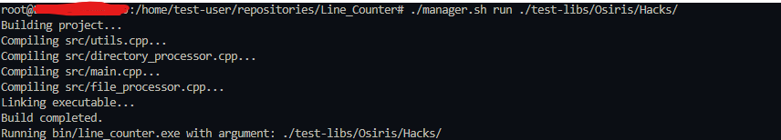

# Line_Counter

## Project Description
Time complexity on my project is O(n^2) with space complexity O(1).

Purpose of this project is to mimic the functionality shown in 'cloc'  terminal commmand which tabulates the files, blanks, comments and code lines in a specific file/directory.

The project seeks to do the same similar to cloc in this regard. The `project structure` is as follows:
```
Line_Counter/
 |
 |---src/
 |    |
 |    |---directory_processor.cpp   (Parse the Directory)
 |    |---directory_processor.h
 |    |---file_processor.cpp        (Parse the files)
 |    |---file_processor.h
 |    |---main.cpp                  (Print Report + Call Functions)
 |    |---utils.cpp                 (To place all utility functions)
 |    |---utils.h
 |
 |---include/
 |    |
 |    |---line_counts.h             (Store my structs)
 |
 |---report/
 |    |
 |    |---report.txt                (Where report of the path/file is stored)
 |
 |---.gitignore
 |
 |---manager.sh                     (Store commands for compilation/builds)
```

**This project is done by sticking to a more functional programming style rather than Object Oriented Programming (OOP) more as test to myself. There is still a struct typical of C++, but it is mostly functions.**

## Specifications

### Windows Subsystem for Linux (WSL)
This project is done in wsl, ideally, any system with the relevant c libraries and can use bash script can run this file.

### Windows (not advised)
During past development with C/C++, I have noted library glibc wasn't present in some windows systems including mine when creating my own compiler, which caused a host of issues. To avoid this, I try to avoid windows development in C/C++ now. 

### Linux (Ubuntu, Debian etc.)
Able to run them. As long as you have the relevant C/C++ libraries.

## How to run

1) Ensure you are able to run .sh files in your system and have given the relevant access to it:
```
chmod +X ./manager.sh
```
2) Now run it:
```
./manager.sh run <path/from/current/directory/to/target/directory/or/File>
```

This will auto clean, build and run the project everytime it is run for smooth usage. `manager.sh` also can run its isolated parts as well:

1) To build the project
```
./manager.sh build
```
2) To clean the project of binary files
```
./manager.sh clean
```

**Note that the path is the path from the user's current terminal directory to the target directory/file.**

## Output

The output from Line_Counter that is expected is similar to that of cloc's output.

e.g. Cloc Output:
```
-------------------------------------------------------------------------------
Language                     files          blank        comment           code
-------------------------------------------------------------------------------
C++                             11            311             22           1547
C/C++ Header                    11             71              0            396
-------------------------------------------------------------------------------
SUM:                            22            382             22           1943
-------------------------------------------------------------------------------
```

e.g. Line_Counter Output

1) Running the project to the Hacks Directory



2) View report.txt in folder ./report to see results
```
./test-libs/Osiris/Hacks/
-------------------------------------------------------------------------------
 Files   Lines    Code  Comments  Blanks
-------------------------------------------------------------------------------
    11    1880    1547        22     311
-------------------------------------------------------------------------------
```

3) (optional) Can also be run against the .cpp/.cc/.c file as well
```
./test-libs/Osiris/Hacks/Aimbot.cpp
-------------------------------------------------------------------------------
 Files   Lines    Code  Comments  Blanks
-------------------------------------------------------------------------------
     1     210     166         0      44
-------------------------------------------------------------------------------
```

There is no header count nor is there any sum count for this project.

## Design Choices

- Chose C++ for this project because of speed purposes.
- I used regex search due to speed as well. For line based searches, especially since I want to handle multiple cases with a single expression, I resorted to this. Later when multiline block comments with `specific edge cases` popped up, I had to resort to the traditional if-else and .find() methods.
- Chose to place the .h files in src instead of include as I think that main functionality should all be placed in src even h files, stuff like the line_counts.h in /include folder is a struct thus I think it should be put there.

## Issues discovered

### File parsing issue with cloc

Over the course of this project, I have noticed some discrepancies with my implementation compared to cloc, namely the file parsing might be wrong for cloc's.

These are the filepaths for the test-libs Osiris folder as test cases:
```
File path: ./test-libs/Osiris/Hooks.cpp
File path: ./test-libs/Osiris/Interfaces.cpp
File path: ./test-libs/Osiris/Memory.cpp
File path: ./test-libs/Osiris/nSkinz/item_definitions.cpp
File path: ./test-libs/Osiris/nSkinz/Utilities/Platform.cpp
File path: ./test-libs/Osiris/nSkinz/config_.cpp
File path: ./test-libs/Osiris/imgui/stripped.cpp
File path: ./test-libs/Osiris/imgui/imgui_widgets.cpp
File path: ./test-libs/Osiris/imgui/imgui.cpp
File path: ./test-libs/Osiris/imgui/imgui_draw.cpp
File path: ./test-libs/Osiris/imgui/imgui_impl_dx9.cpp
File path: ./test-libs/Osiris/imgui/imgui_impl_win32.cpp
File path: ./test-libs/Osiris/imgui/imgui_demo.cpp
File path: ./test-libs/Osiris/Hacks/Reportbot.cpp
File path: ./test-libs/Osiris/Hacks/SkinChanger.cpp
File path: ./test-libs/Osiris/Hacks/AntiAim.cpp
File path: ./test-libs/Osiris/Hacks/Aimbot.cpp
File path: ./test-libs/Osiris/Hacks/Glow.cpp
File path: ./test-libs/Osiris/Hacks/Visuals.cpp
File path: ./test-libs/Osiris/Hacks/Chams.cpp
File path: ./test-libs/Osiris/Hacks/Triggerbot.cpp
File path: ./test-libs/Osiris/Hacks/Backtrack.cpp
File path: ./test-libs/Osiris/Hacks/Esp.cpp
File path: ./test-libs/Osiris/Hacks/Misc.cpp
File path: ./test-libs/Osiris/Netvars.cpp
File path: ./test-libs/Osiris/Config.cpp
File path: ./test-libs/Osiris/SDK/GlobalVars.cpp
File path: ./test-libs/Osiris/Osiris.cpp
File path: ./test-libs/Osiris/jsoncpp.cpp
File path: ./test-libs/Osiris/GUI.cpp
```

According to my implementation it is thus 30 files as seen below, tallied up correctly with me physically checking said folder of the files:
```
./test-libs/Osiris/
-------------------------------------------------------------------------------
 Files   Lines    Code  Comments  Blanks
-------------------------------------------------------------------------------
    30   38430   30450      3971    4009
-------------------------------------------------------------------------------
```

And yet cloc itself didn't detect one of them:
```
github.com/AlDanial/cloc v 1.90  T=0.22 s (475.1 files/s, 255996.8 lines/s)
-------------------------------------------------------------------------------
Language                     files          blank        comment           code
-------------------------------------------------------------------------------
C++                             29           4009           3978          30443
C/C++ Header                    73           2110           3511          11370
XML                              2              0              0            619
-------------------------------------------------------------------------------
SUM:                           104           6119           7489          42432
-------------------------------------------------------------------------------
```

### Difference between comment vs code line definiton for cloc vs my own implementation

As can be seen above, when checking the folder there is a difference of code and comments between my implementation and cloc's, 30450 vs 30443 and 3971 vs 3978.

I have reduced the possible possibilities with the parsing to a few factors as well as narrowed down this discrepancy to imgui/imgui_demo.cpp:

The code for the file with this discrepancy is the only one that has double comments in the same line. Stuff like this:
```
// Test etststtatstasdasdas // addtional comment syntax after comment
```

which could have led to a confusion of a more than one comment in the same line, line 266 is a prime example of one of this case. 

## Conclusions and regrets on my end

There are some issues on my end too, in terms of speed compared to cloc it is much slower, 3-5 seconds slower when it came to parsing a folder. 

Accessibility to files could've been improved as well by pushing this to docker so that it can be run in windows as well. 